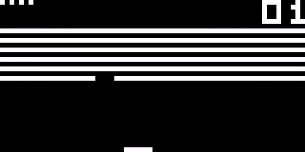
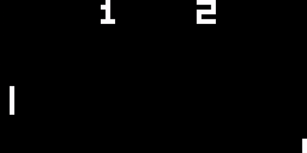
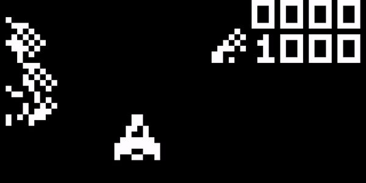

# CHIP8 Emulator

A simple CHIP8 emulator/interpreter written in C++

  ## Building and Running
* Use CMake to build
* **SDL2** is required
  * On Linux, simply install SDL2 via your package manager
  * On Windows, download the SDL2 development package (https://github.com/libsdl-org/SDL/releases/tag/release-2.30.2) then set the SDL2_DIR variable in CMake to point to the 'cmake' folder in this package
* To run the emulator, invoke it from the command line and pass the location of the ROM as the argument: `CHIP8 <PATH_TO_ROM>`
